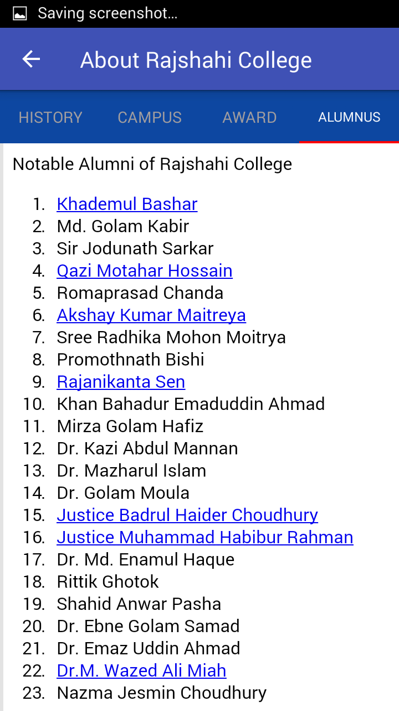

<h1>Name : Rajshahi College</ha>

<h3>Project Features</h3>
<ol>
  <li>Details information aboot College</li>
  <li>Details information aboot 24 Departments</li>
  <li>Details information aboot Teachers and Staff</li>
  <li>Different Layout for Landscape and Portrait</li>
  <li>Navigation Drawer and Menu option</li>  
  <li>Tab Layout and Google Location</li> 
  <li>Firebase Realtime Chat Room for College</li>
  <li>Notice Board and Upload notice Using Restfull API</li>
  <li>Extra Co-Curriculam Activity</li>
</ol>

<h3>Development Tools &Technologies</h3>
<ul>
  <li>Java</li>
  <li>XML</li>
  <li>Restfull API</li>
  <li>Firebase Realtime Chat</li>
  <li>Google Location</li>
</ul>

<h3>Database</h3>
<ul>
  <li>SQLite</li>
  <li>Firebase</li>
</ul>

<h3>Using IDE for project development</h3>
 <ul>
  <li>Android Studio 3.1</li>
  <li>Sublime Text-3</li>
 </ul>

<h3>Using Library</h3>
 <ol>
  <li>appcompat-v7:24.0.0'</li>
  <li>support:design:24.0.0'</li>
  <li>gms:play-services-maps:9.6.1'</li>
  <li> gms:play-services-location:9.6.1'</li>
  <li>firebase:firebase-core:9.6.1'</li>
  <li>firebase:firebase-database:9.6.1'</li>
  <li>volley:volley:1.0.0'</li>
  <li>support:support-v4:23.4.0'</li>
  </ol>

<h2>Home Screen Landscape and Portrait</h2>

    
    

<h2>Navigation Drawer, Menu Bar and Tab Lauout</h2>

    
    
    

<h2>Details Information About College</h2>

    
    
    

<h2>Details information abour departments. </h2>

    
    
    

<h2>Notice boadr and upload notice using Restfull API</h2>

    
    
    

<h2>Realtime Chatting using Firebase</h2>

    
    
    
    

<h2>College Co-Curriculum Activities</h2>

    
    
    

<h2>More Information</h2>

    
    
    

